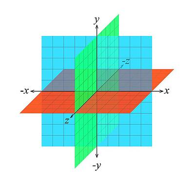

# Cartesian Coordinate System

# Translation
This operation shifts the entire coordinate system (and all objects within it) by a specified distance in the x, y, and z directions. Think of it as sliding the whole system without changing the relative positions of points within it.

# Rotation
Rotate objects around any of the axes (x, y, or z) by a certain angle. This effectively changes the orientation of the object in space.

# Scaling
This operation uniformly enlarges or shrinks an object along each axis. You can scale by a single factor to make everything bigger or smaller, or use separate factors for each axis to stretch or compress the object in specific directions.