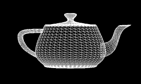

# Wireframe
\
A wireframe in the context of 3D modeling and graphics is a visual representation of a three-dimensional (3D) physical object used in 3D computer graphics. It is created by specifying each edge of the physical object where two mathematically continuous smooth surfaces meet, or by connecting an object's constituent vertices using straight lines or curves.

In the context of web design and software development, a wireframe is a schematic, a blueprint, useful to help designers and clients visually understand a site's or application's functional requirements. It's a low-fidelity design layout that serves as the backbone of your design.

The term "wireframe" in your markdown file could refer to either of these concepts, depending on the context.

# Cartesian System
\
The Cartesian system, also known as the Cartesian coordinate system, is a coordinate system that specifies each point uniquely in a plane by a set of numerical coordinates, which are the signed distances to the point from two fixed perpendicular directed lines, measured in the same unit of length.

In 3D space, the Cartesian system is extended to include a third axis, typically labeled z, perpendicular to the other two. This results in a three-dimensional coordinate system where each point in space is specified by three coordinates (x, y, z).

The Cartesian system is named after René Descartes, who introduced it in the 17th century. It's fundamental in mathematics, physics, engineering, computer graphics, and many other fields.

# Lines
In mathematics, a line is a straight one-dimensional figure that extends infinitely in both directions. It is often described as the shortest distance between any two points.

In the context of a Cartesian system, a line can be represented by an equation in two dimensions (2D) or three dimensions (3D).

In 2D, a line is often represented by the equation `y = mx + b`, where `m` is the slope of the line and `b` is the y-intercept.

In 3D, a line can be represented in parametric form as `x = x0 + at`, `y = y0 + bt`, and `z = z0 + ct`, where `(x0, y0, z0)` is a point on the line and `(a, b, c)` is the direction vector of the line. The parameter `t` varies over all real numbers.

In the context of computer graphics and 3D modeling, a line is often represented as a sequence of points or vertices. This is particularly relevant when discussing wireframe models, where the edges of the model are represented as lines.

# Points
In mathematics, a point is a primitive notion upon which the geometry is built. Being a primitive notion means that a point cannot be defined in terms of previously defined concepts. It is only described to a certain extent, using the mental imagery that each of us has about the idea of a point.

In the context of a Cartesian system, a point is a location in space which is described by coordinates. In two dimensions (2D), a point is represented as `(x, y)`, and in three dimensions (3D), a point is represented as `(x, y, z)`, where `x`, `y`, and `z` are the distances from the point to the respective axes.

In computer graphics and 3D modeling, a point often refers to a vertex, which is a data structure that contains information about a single point in space, such as its position and possibly other attributes such as color, normal vector, and texture coordinates.

# Isometric Projection
\
Isometric projection is a method for visually representing three-dimensional objects in two dimensions. It is a form of orthographic projection, or parallel projection, where all the projection lines are parallel to each other.

In an isometric projection, the three coordinate axes appear equally foreshortened, and the angle between any two of them is 120 degrees. This gives the viewer a way to see three dimensions without the distortion of perspective.

In 2D graphics, isometric projection is used to create an illusion of 3D, and is commonly used in video games, technical drawings, and architectural plans.

In terms of 3D graphics programming, an isometric projection can be achieved by using an orthographic projection instead of a perspective projection, and then rotating the camera to the desired angle. The orthographic projection maintains the size of objects regardless of their distance from the camera, which is a key characteristic of isometric views.

Here's a simple formula for an isometric projection with a **30-degree angle** between the three visible axes (front, top, and side):

`new_x = (isometric_factor * x + isometric_factor * z) / 2`

`new_y = (isometric_factor * y - (isometric_factor * x - isometric_factor * z)) / 2`

# 3D Rotation

Rotating a 3D object involves applying a rotation matrix to each of the object's vertices. The rotation matrix depends on the axis of rotation. Here are some methods to do so:

## **1. Euler Angles:**

Euler angles represent a rotation by specifying three successive rotations around the **fixed axes** (X, Y, and Z) in a specific order (e.g., Z-X-Z). Each angle describes the amount of rotation around its corresponding axis.

* **Advantages:**
    * Intuitive for beginners, as it relates to rotations around familiar axes.
    * Relatively easy to understand conceptually.
* **Disadvantages:**
    * Can suffer from gimbal lock, where certain combinations of angles result in no rotation or loss of a degree of freedom.
    * Not the most efficient method for calculations.

## **2. Rotation Matrices:**

Rotation matrices are 4x4 matrices that encode the complete rotation information. The specific values within the matrix depend on the rotation angle and axis.

* **Advantages:**
    * Efficient for calculations and computations.
    * Can be easily combined to perform complex rotations involving multiple axes.
* **Disadvantages:**
    * Can be less intuitive for beginners to understand compared to Euler angles.
    * Converting between rotation matrices and other representations (like Euler angles) can involve complex calculations.

## **3. Quaternions:**

Quaternions are a mathematical construct using four numbers to represent a rotation. They offer some advantages over other methods.

* **Advantages:**
    * No gimbal lock like Euler angles.
    * Efficient for calculations and interpolation between rotations.
    * More compact representation compared to 3x3 rotation matrices.
* **Disadvantages:**
    * Less intuitive concept for beginners compared to Euler angles or axis-angle.
    * Quaternion multiplication can be more complex than matrix multiplication.

## **4. Axis-Angle Representation:**

This method specifies a rotation by defining a unit vector representing the axis of rotation and an angle of rotation around that axis.

* **Advantages:**
    * Relatively simple and intuitive concept.
    * No gimbal lock like Euler angles.
* **Disadvantages:**
    * Can be less efficient for some calculations compared to quaternions or rotation matrices.
    * Converting between axis-angle and other representations might involve trigonometric calculations.

## **5. Spherical Linear Interpolation (SLERP):**

SLERP is a technique used to interpolate smoothly between two rotations represented by quaternions. This is useful for creating animations where objects need to rotate gradually over time.

* **Advantages:**
    * Provides smooth and natural-looking interpolation between rotations.
    * Avoids the problems of linear interpolation with quaternions.
* **Disadvantages:**
    * Requires quaternion representation for the rotations.
    * Slightly more complex calculation compared to linear interpolation. 

**Choosing the Method:**

The best method for your specific application depends on various factors:

* **Level of intuitiveness:** If you're a beginner, Euler angles might be easier to grasp initially.
* **Computational efficiency:** Rotation matrices and quaternions are generally preferred for performance-critical tasks.
* **Gimbal lock:** If you need to avoid gimbal lock, quaternions or axis-angle are better choices.
* **Interpolation:** SLERP is specifically useful for smooth rotation animations using quaternions.

**Additional Resources:**

* Rotation Representations in 3D: [https://en.wikipedia.org/wiki/Rotation_formalisms_in_three_dimensions](https://en.wikipedia.org/wiki/Rotation_formalisms_in_three_dimensions)
* 3D Geometric Transformations: [https://www.geeksforgeeks.org/videos/3-d-transformation-translation-in-computer-graphics/](https://www.geeksforgeeks.org/videos/3-d-transformation-translation-in-computer-graphics/)
